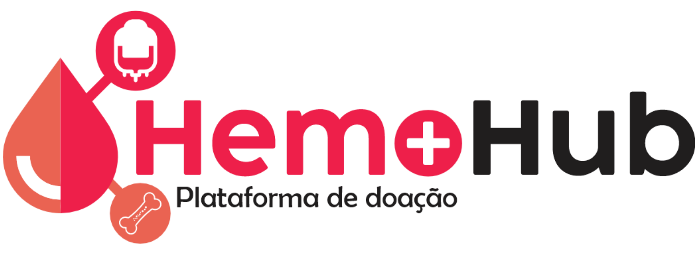
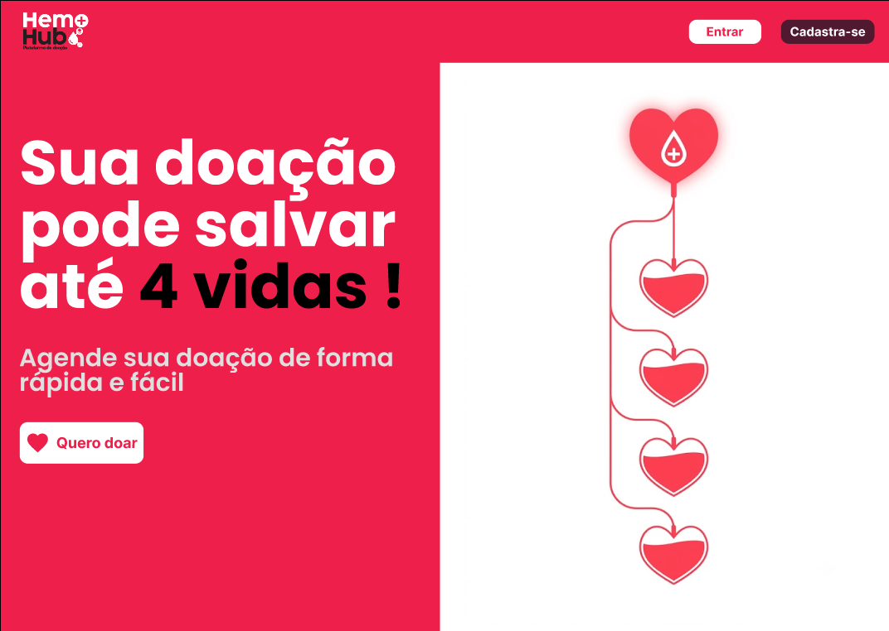
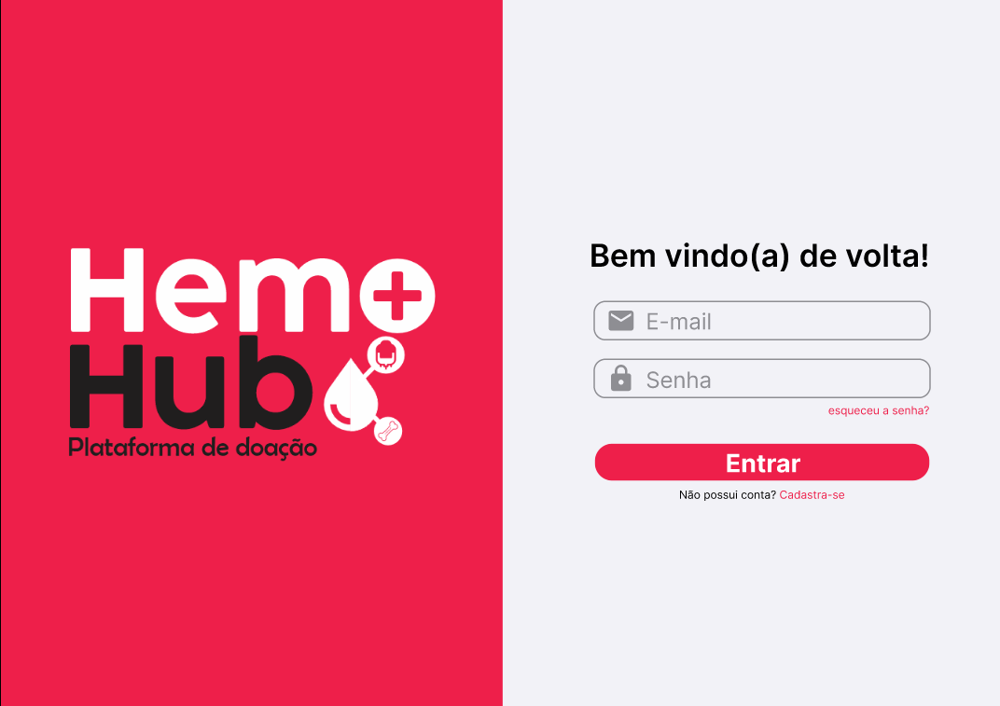
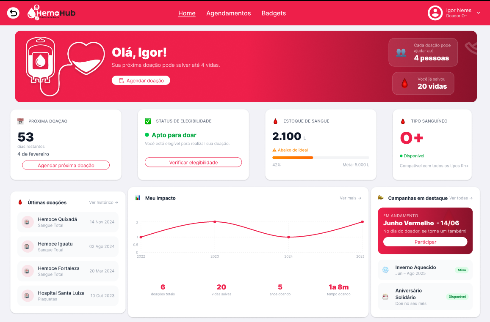
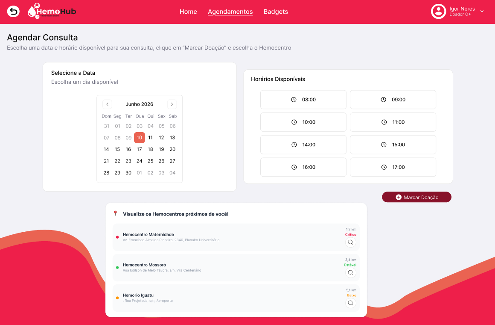
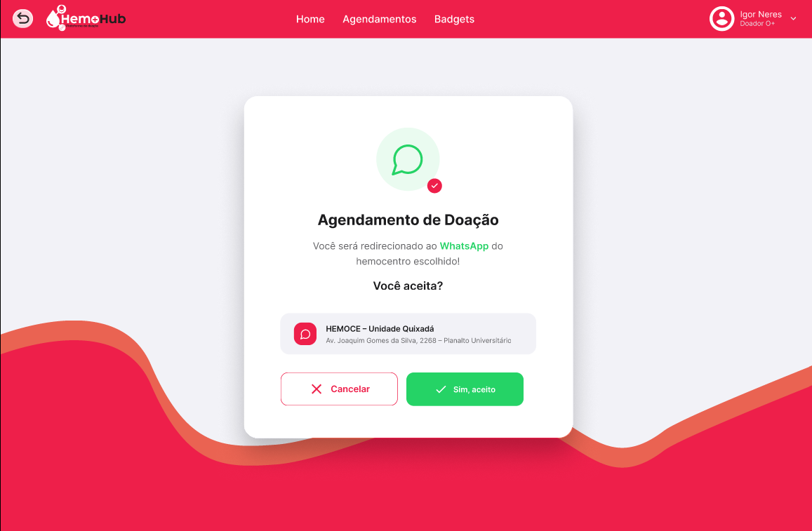
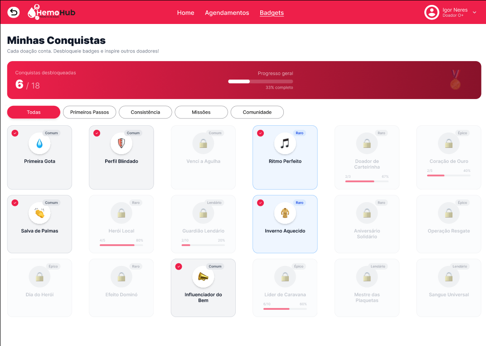
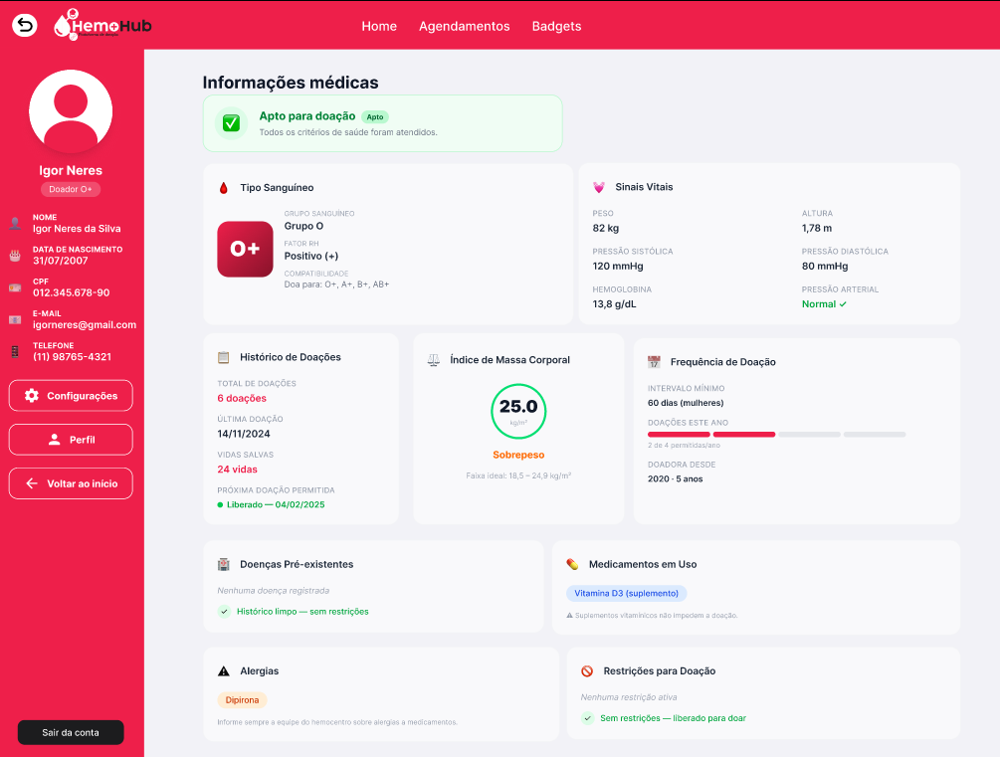
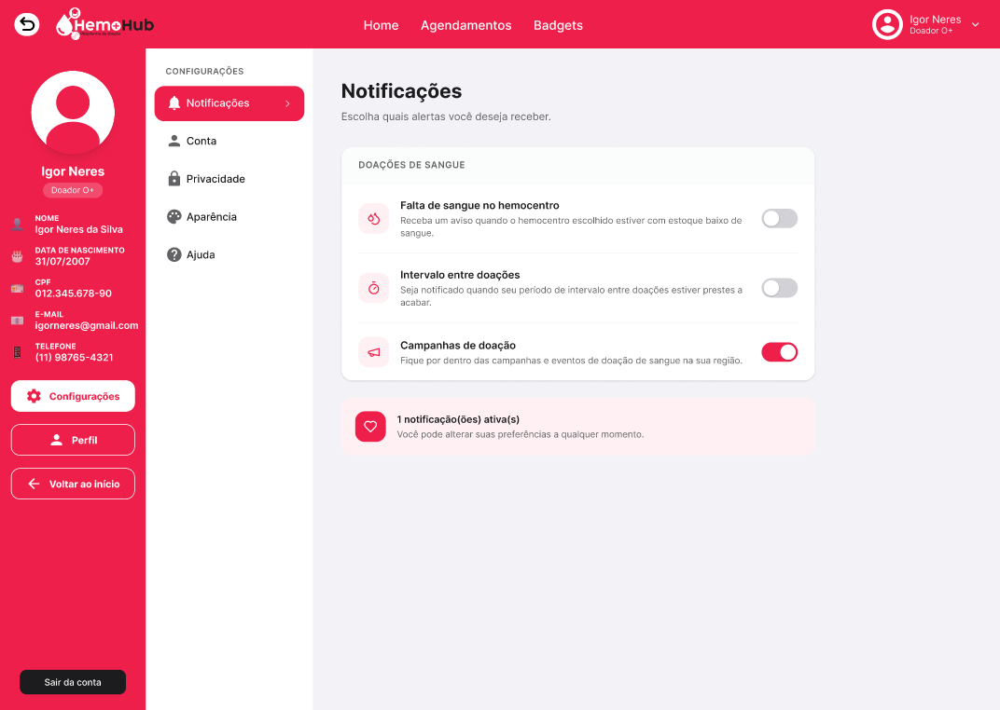

<h1 align="center">🩸 HemoHub</h1>

<b>Conectando doadores e hemocentros através de uma experiência digital simples, intuitiva e centrada no usuário.</b>

# 📑 Índice

- [Sobre](#-sobre-o-projeto)
- [Objetivos](#-objetivos)
- [Funcionalidades](#-funcionalidades)
- [Pesquisa e UX](#-pesquisa-e-processo-de-ux)
- [Heurísticas de Nielsen](#-heurísticas-de-usabilidade)
- [Protótipo](#-protótipo)
- [Galeria](#-galeria)
- [Ferramentas](#-ferramentas-utilizadas)
- [Próximos Passos](#-próximos-passos)
- [Equipe](#-equipe)

---

# 📖 Sobre o Projeto

O **HemoHub** é um projeto desenvolvido durante a disciplina de **Interação Humano-Computador (IHC)** com o objetivo de incentivar a doação de sangue por meio de uma plataforma digital intuitiva, acessível e centrada no usuário.

A proposta surgiu após pesquisas com usuários, entrevistas e levantamento de dificuldades enfrentadas tanto por pessoas que nunca doaram sangue quanto por doadores recorrentes.

Nosso objetivo foi criar uma solução capaz de aproximar a população dos hemocentros, reduzir barreiras durante a jornada de doação e tornar toda a experiência mais simples, rápida e agradável.

Todo o desenvolvimento foi baseado em metodologias de UX Design, pesquisa com usuários, prototipação em alta fidelidade e testes de usabilidade.

---

# 🎯 Objetivos

- Incentivar a doação de sangue.
- Atrair novos doadores.
- Facilitar o agendamento das doações.
- Diminuir dúvidas sobre o processo de doação.
- Melhorar a comunicação entre hemocentros e doadores.
- Centralizar informações importantes em um único ambiente.
- Aumentar o engajamento através de gamificação.
- Oferecer uma experiência intuitiva e acessível.

---

# 🚀 Funcionalidades

<table>

<tr>

<td width="50%">

<h3>🌎 Landing Page</h3>

A Landing Page foi desenvolvida para apresentar o projeto ao público, conscientizar sobre a importância da doação de sangue e incentivar novos usuários a iniciarem sua jornada como doadores.

Ela possui uma interface objetiva, moderna e voltada para conversão, servindo como porta de entrada da plataforma.

</td>

<td width="50%">

<h3>🔐 Login, Cadastro e Recuperação de Senha</h3>

Fluxos simples e intuitivos para autenticação dos usuários.

O cadastro foi dividido em etapas para reduzir a carga cognitiva, enquanto o processo de recuperação de senha garante segurança e facilidade de acesso.

</td>

</tr>

<tr>

<td>

<h3>🏠 Home</h3>

A Home concentra as informações mais importantes da plataforma.

Entre elas:

- 📰 Notícias
- ❤️ Seu impacto na sociedade
- 📢 Campanhas de doação
- 📅 Próxima doação
- 💡 Informações rápidas sobre doação
- ⚡ Acesso rápido às funcionalidades

</td>

<td>

<h3>📅 Agendamento</h3>

Permite selecionar:

- Hemocentro
- Data
- Horário

O fluxo foi pensado para reduzir etapas e facilitar o processo de marcação da doação.

</td>

</tr>

<tr>

<td>

<h3>🏅 Sistema de Badges</h3>

O sistema de conquistas foi criado para incentivar a recorrência das doações.

Os usuários desbloqueiam badges conforme sua participação na plataforma e sua jornada como doadores.

Além do reconhecimento visual, as conquistas poderão futuramente ser utilizadas para obtenção de benefícios oferecidos pelos hemocentros ou parceiros, como certificados, brindes em campanhas, participação em eventos e outras formas de reconhecimento.

</td>

<td>

<h3>👤 Perfil</h3>

O perfil reúne todas as informações do usuário.

São apresentados dados como:

- Tipo sanguíneo
- Peso
- Altura
- CPF
- Telefone
- E-mail
- Quantidade de doações
- Última doação

As informações médicas são editáveis **exclusivamente pelos profissionais do hemocentro**, garantindo maior confiabilidade, segurança e autenticidade dos dados apresentados ao usuário.

</td>

</tr>

<tr>

<td colspan="2">

<h3>⚙ Configurações</h3>

Área destinada às preferências da conta, notificações e configurações gerais da plataforma.

</td>

</tr>

</table>

---

# 🔍 Pesquisa e Processo de UX

Todo o projeto foi desenvolvido utilizando uma abordagem **User-Centered Design (UCD)**.

Durante o desenvolvimento foram realizadas diversas etapas para compreender o comportamento dos usuários e construir uma solução realmente útil.

O processo incluiu:

- Pesquisa com usuários
- Formulários online
- Entrevistas
- Construção de Personas
- Cenários de uso
- Arquitetura da Informação
- Wireframes
- Prototipação em alta fidelidade
- Testes de Usabilidade
- Coleta de feedback
- Iterações de melhoria

Essa abordagem permitiu identificar dificuldades reais dos usuários e orientar decisões de design baseadas em evidências.

---

# 📐 Heurísticas de Usabilidade

Durante todo o projeto buscamos aplicar as **10 Heurísticas de Jakob Nielsen**, tornando a experiência mais intuitiva e eficiente.

| Heurística | Aplicação no HemoHub |
|------------|----------------------|
| ✅ Visibilidade do estado do sistema | Feedback constante durante login, cadastro e agendamento. |
| ✅ Correspondência entre sistema e mundo real | Linguagem simples, termos conhecidos e informações organizadas de forma natural. |
| ✅ Controle e liberdade do usuário | Possibilidade de retornar etapas, cancelar ações e navegar livremente. |
| ✅ Consistência e padronização | Componentes, ícones, cores e estilos mantidos em toda a plataforma. |
| ✅ Prevenção de erros | Validações em formulários, confirmações e mensagens preventivas. |
| ✅ Reconhecimento em vez de memorização | As principais funções permanecem sempre visíveis e acessíveis. |
| ✅ Flexibilidade e eficiência | Usuários recorrentes conseguem realizar tarefas rapidamente através de atalhos presentes na Home. |
| ✅ Design minimalista | Interface limpa, organizada e focada apenas nas informações realmente importantes. |
| ✅ Mensagens claras de erro | Erros apresentados de forma compreensível e orientando o usuário sobre como solucioná-los. |
| ✅ Ajuda e documentação | Informações rápidas sobre doação e orientações distribuídas em toda a plataforma. |

---

# 🎨 Protótipo

Todo o protótipo foi desenvolvido utilizando o **Figma**.

📎 **Acesse o protótipo:**

> 🔗 https://www.figma.com/proto/1c4wfavjSeq5EhDDXo1JSi/Hemohub?node-id=0-1&t=tNrKlYYbJcgLHq1L-1

---

# 🖼 Galeria

## 🎯 Landing Page

---

## 🔐 Login

---

## 🏠 Home

---

## 📅 Agendamento

---

## ✅ Confirmação do Agendamento

---

## 🏅 Sistema de Badges

---

## 👤 Perfil

---

## ⚙ Configurações

# 🛠 Ferramentas Utilizadas

---

# 📈 Resultados

Após os testes de usabilidade foi possível identificar diversos pontos positivos da plataforma.

✅ Fluxo intuitivo

✅ Boa aceitação visual

✅ Navegação simples

✅ Facilidade de agendamento

✅ Clareza das informações

Além disso, os testes permitiram identificar oportunidades de melhoria relacionadas ao contraste de algumas informações, organização dos dados do perfil e clareza das instruções iniciais, tornando possível evoluir continuamente a experiência do usuário.

---

# 🚀 Próximos Passos

- Integração com hemocentros reais.
- Sistema de notificações em tempo real.
- Histórico completo das doações.
- Dashboard administrativo.
- Integração com banco de dados.
- Programa oficial de recompensas utilizando as badges conquistadas.

---

# 👨‍💻 Equipe

Desenvolvido pela equipe **Error 404** para a disciplina de **Interação Humano-Computador (IHC)**.

---

<strong>Se este projeto chamou sua atenção, deixe uma ⭐ no repositório!</strong>

